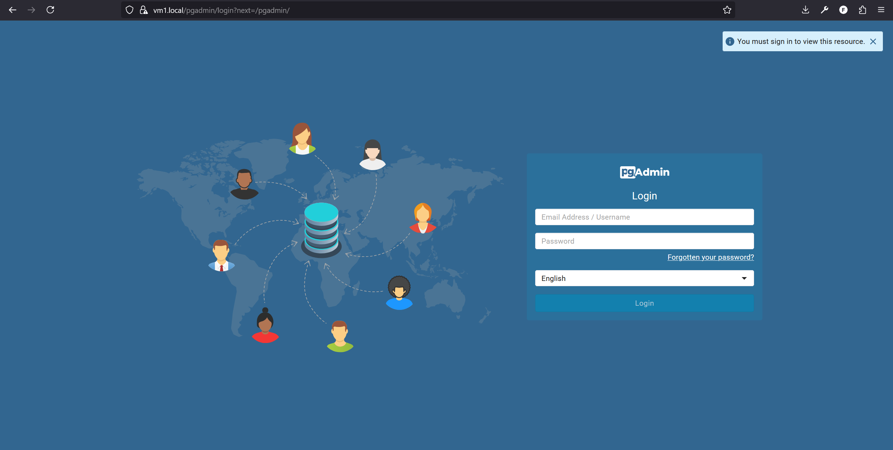
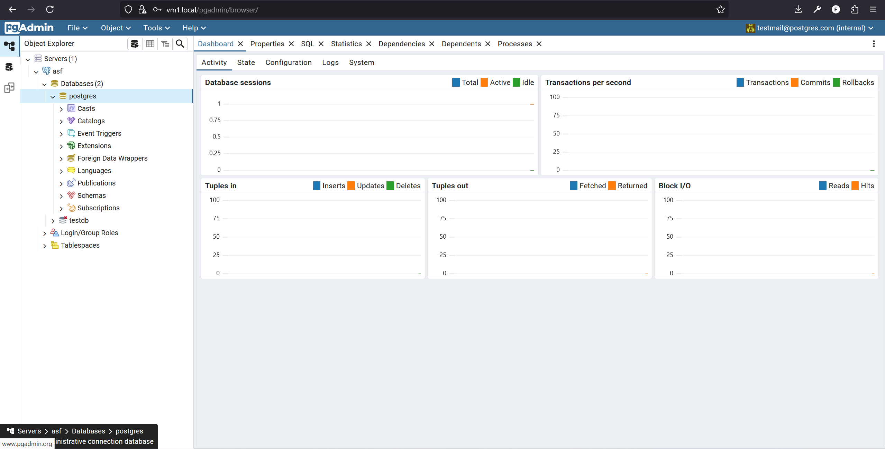
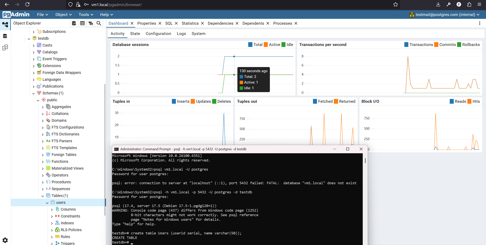

# Тестовое задания для Вебби


## Описание
Этот проект представляет из себя решение задания по настройки двух виртуальных машин с докер контейнерами и конфигурацией соединения между ними и хостом

---

## ПО
### Общие
- Хост машина: использовалась Windows 11.
- Виртуальные машины: [Ubuntu server](https://releases.ubuntu.com/22.04/)
- Oracle VirtualBox
- На обоих машинах нужен docker, docker-compose

### VM1
- Dnsmasq для решения доп задания

---

## Quickstart

Здесь представлен гайд по общей конфигурации машин и хоста, конкретные гайды по настройке каждой машины представлены в конце этого гайда, ссылками.

Первым этапом настройки будет скачивание Oracle VirtualBox и образа Ubuntu server. После загрузки необходимого в VirtualBox добавляем две машины VM1 и VM2, далее переходим к настройке сетей машин.

Заходим в настройки первой машины, выбираем Network, здесь нужно иметь три адаптера, NAT есть по умолчанию, добавляем еще Host-only adapter(нужен чтобы машина общалась с хостом) и Internal Network(нужен для общения машин между собой), настройки оставляем по умолчанию 

В настройках VirtualBox заходим File->Tools->Network Manager->Host-Only Networks если нет адаптера VirtualBox Host-Only Adapter то его нужно добавить, для дальнейшего удобства лучше задать IPv4 Address: 192.168.56.1 и маску 255.255.255.0

Далее запускаем машины и переходим к их настройке: [гайд для VM1](vm1/ConfigurationGuide.md), [гайд для VM2](vm2/ConfigurationGuide.md)

После настройки машин для проверки того что все работает:

В терминале win должен быть успешный пинг
```
ping 192.168.56.10
```

В терминале на vm1 должен быть успешный пинг
```
ping 192.168.100.20
```

Если все успешно теперь можно написать в браузере http://192.168.56.10/pgadmin и браузер перекинет на страницу регистрации в pgadmin, по дефолту там есть аккаунт
Логин:testmail@postgres.com
Пароль: postgres

---

## Возникшие трудности/неочевидные моменты

Первы

## Скрины

### Подключение к pgadmin с хоста



### Успешный вход в pgadmin с хоста



### Добавление новой таблицы через терминал на хосте


